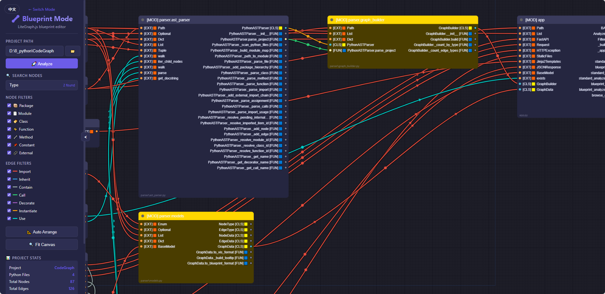

# PythonCodeGraph

Python 代码知识图谱解析与可视化工具（蓝图模式专注版）。

[English](README.md) | 中文

## 项目简介

PythonCodeGraph 基于 Python AST 对目标项目进行静态解析，提取模块、类、函数、方法、常量以及外部依赖关系，并通过蓝图画布进行交互式展示。

系统默认入口为蓝图模式：`/`（同时保留 `/blueprint`）。



## 当前能力

- 项目级 Python 文件扫描（内置常见目录忽略规则）
- 多实体识别：
  - package、module、class、function、method、constant、external
- 多关系识别：
  - imports、inherits、contains、calls、decorates、instantiates、uses
- 外部库层级建模（例如 `external:fastapi.staticfiles`）
- 蓝图模式前端过滤（节点类型、关系类型）
- 节点详情面板（文件、行号、文档字符串、参数、装饰器、基类）
- 引脚级连线映射、关系高亮、双击聚焦子图、返回全图
- 目录浏览 API（含 Windows 盘符入口）
- 内置中英双语切换（English/中文）并持久化语言偏好

## 演示 GIF


## 架构设计

### 后端层

- `app.py`
  - FastAPI 应用入口
  - 页面路由：`/`、`/blueprint`
  - API 路由：
    - `/api/blueprint/analyze`
    - `/api/blueprint/analyze/filtered`
    - `/api/browse`
  - 共享逻辑：`_build_graph`、`_apply_filters`

- `parser/ast_parser.py`
  - 项目扫描、AST 解析、节点边构建
  - 名称解析与去重
  - 外部库导入链和使用关系补全

- `parser/graph_builder.py`
  - 调用解析器
  - 清理孤立点/无效边
  - 统计元数据

- `parser/models.py`
  - 领域模型：`NodeData`、`EdgeData`、`GraphData`
  - 输出适配器：`to_blueprint_format()`

### 前端层

- `templates/blueprint.html` + `static/js/blueprint.js`：蓝图模式
- `static/js/i18n.js`：多语言文案与界面切换
- `static/css/style.css`：公共样式
- `static/css/blueprint.css`：蓝图模式样式补充

## API 文档

### 页面接口

- `GET /`：蓝图模式页面
- `GET /blueprint`：蓝图模式页面

### 分析接口

- `POST /api/blueprint/analyze`
  - 请求示例：
    ```json
    { "path": "D:/your/python/project" }
    ```
  - 返回：蓝图模块/连线结构 + 元数据

- `POST /api/blueprint/analyze/filtered`
  - 请求示例：
    ```json
    {
      "path": "D:/your/python/project",
      "node_types": ["package", "module", "class", "function", "external"],
      "edge_types": ["contains", "imports", "calls", "uses"],
      "show_methods": true,
      "show_variables": false
    }
    ```

### 目录浏览接口

- `GET /api/browse?path=...`
  - 仅返回子目录（隐藏目录默认忽略）
  - Windows 下空路径会返回可用盘符列表

## 安装与运行

### 环境要求

- Python 3.8+
- Chrome/Edge/Firefox 等现代浏览器

### 安装

```bash
python -m venv .venv
.venv\Scripts\activate
pip install -r requirements.txt
```

### 启动

```bash
python app.py
```

或

```bash
uvicorn app:app --host 127.0.0.1 --port 8000 --reload
```

访问：`http://127.0.0.1:8000`

## 已知边界

- 当前为静态分析，不执行运行时追踪。
- 大于 1MB 的 Python 文件默认跳过。
- 文件解码优先 UTF-8，失败后尝试 GBK。
- 常量提取目前仅覆盖全大写或双下划线命名。
- 调用关系边当前以模块为调用源（不是函数级调用者节点）。

## 目录结构

```text
PythonCodeGraph/
    app.py
    requirements.txt
    documents/
        blueprint.gif
    parser/
        ast_parser.py
        graph_builder.py
        models.py
    templates/
        blueprint.html
    static/
        css/
            style.css
            blueprint.css
        js/
            blueprint.js
            i18n.js
            litegraph.min.js
```

## 框架开发指南

详见：[documents/FRAMEWORK_DEVELOPMENT_GUIDE_CN.md](documents/FRAMEWORK_DEVELOPMENT_GUIDE_CN.md)

## 许可证

MIT License，见 [LICENSE](LICENSE)。
